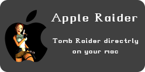

## Apple Raider

Welcome to Apple Raider, a place for find the best ways to run Tomb Raider 1/5 on your Mac, both Intel and Apple Silicon
Pull Requests are Welcome 😃

## Disclaimer

I'm not affilated with Core Design, Eidos Interactive and other Tomb Raider producers and publishers, this is just a fan project 
Also TR1X and TR2X are a fan project of [Lost Artefacts](https://github.com/LostArtefacts/TRX)

## What is this project?
This is a project made for helping mac users to install Tomb Raider on their macs, without needing to switch to a pc

## How does it work?

It consist to have a documentation in HTML of steps and softwares to use and have python scripts for make a simple and faster installation
For start it you can run `main.py` for python scripts `Run Server.command` for run a server to `localhost:8000` for use a feature on my HTML that normally opening the file doesn't work, since to the browsers security, indipendently from Firefox and Chromium browsers
